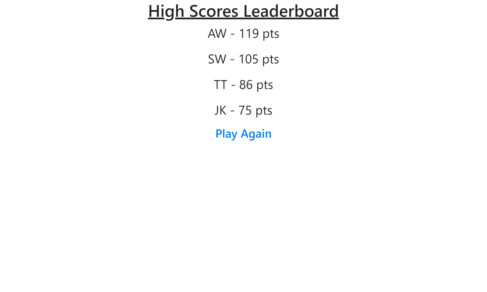

# 🔥 Rapid Fire Quiz Game 🔥

Rules: This quiz game is a race to answer all questions correctly as fast as possible. Your final score isthe time remaining when all questions are answered. If you get a question right a new question will appear. If you get a question wrong, the time will subtract 10 seconds and display a new question. If your score goes below zero before all questions are answered then the quiz will end. When all questions are answered the quiz will end. If the time runs out the quiz will end.

## User Story

The purpose of this project is to demostrate my understanding of JavaScript and Web APIs as taught to me through the UNC Bootcamp Module 4. In particular, this can be seen through the use of skills such as traversing the DOM, setting attributes, appending elements, time intervals, and local storage. Using these particular skills I was able to build an application that meets the acceptance criteria below. I have provided mock ups showing how a user might be able to see the page when initially opened, when the game is running, and if they click to view highscores. 

## Acceptance Criteria

```
GIVEN I am taking a code quiz
WHEN I click the start button
THEN a timer starts and I am presented with a question
WHEN I answer a question
THEN I am presented with another question
WHEN I answer a question incorrectly
THEN time is subtracted from the clock
WHEN all questions are answered or the timer reaches 0
THEN the game is over
WHEN the game is over
THEN I can save my initials and my score
```

## Mock-Up




## License

---

© 2023 edX Boot Camps LLC. Confidential and Proprietary. All Rights Reserved.
